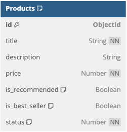
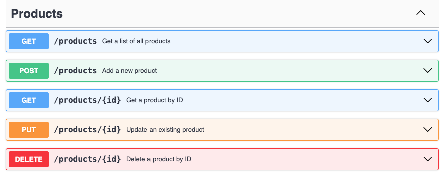

# NSOS-fullstack-assessment

nSquareOffshore assessment solution - .dbml, OpenAPI Specs, node.js, Express, MongoDB, React, Redux.

<b> Database schema and collections: </b>

<b> API Endpoints: </b>

